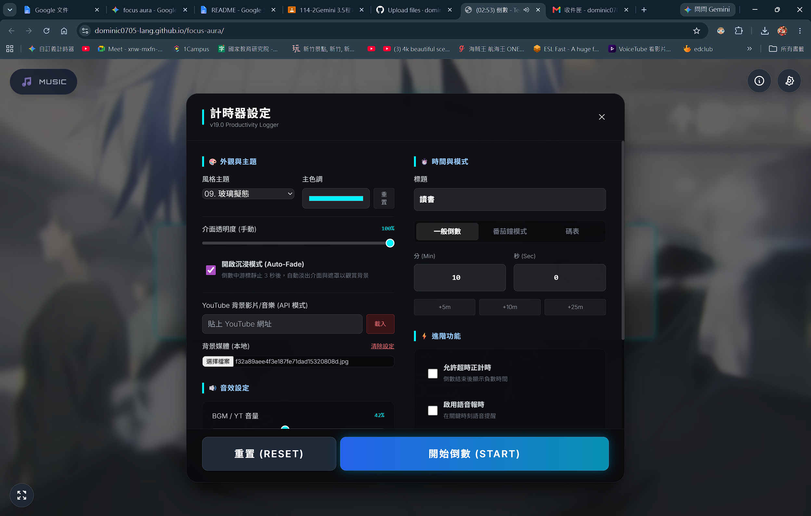
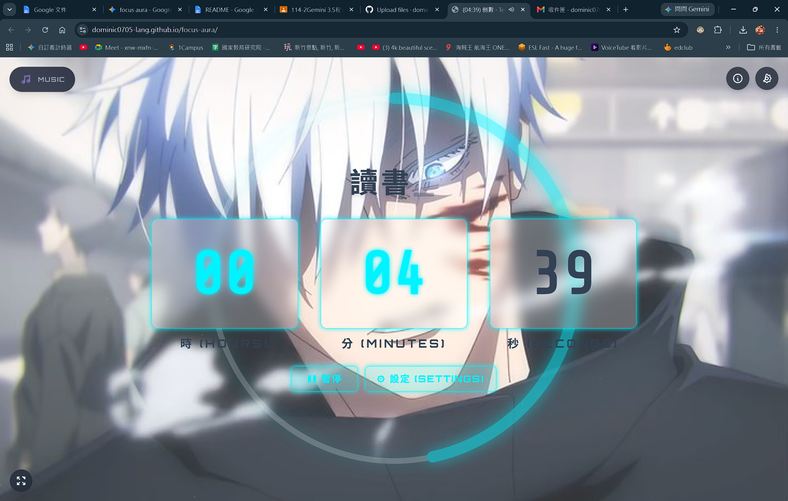

Tech Countdown / 多風格倒數計時器 🚀
English | 繁體中文
繁體中文
這是一個由 施棨耀 (13歲) 開發的開源網頁應用程式。這最初是一個個人學習專案，經過多次迭代重構，現在已經演變成一個具備專業級架構、流暢視覺體驗與多功能的生產力計時器。
在這個專案開發的過程中，我使用了 Gemini 作為我的程式開發夥伴。透過與 AI 的協作，我不僅成功實作了模組化的物件導向架構 (OOP)、Canvas 動畫與 Web Audio API，更學習到了如何處理複雜的網頁效能優化與架構設計。這是我在 13 歲這年最引以為傲的學習成果。
✨ 核心功能 (Features)
⏱️ 三大計時模式:
一般倒數 (Standard): 自訂倒數時間。
番茄鐘 (Pomodoro): 工作與休息時間自動循環。
碼表 (Stopwatch): 無限正計時模式。
🎨 10+ 款自訂主題: 賽博龐克、極簡白、深空宇宙等多種風格。
🌊 極致流暢的視覺體驗: 使用 requestAnimationFrame 實現高幀率的圓環特效，並加入數字滑動動畫。
🌌 沉浸模式 (Immersive Auto-Fade): 滑鼠靜止後自動隱藏 UI，適合當作動態桌布。
📥 生產力歷程記錄: 自動記錄操作時間並匯出為 JSON 檔供分析。
🔒 防止休眠: 整合 Wake Lock API，確保計時不因螢幕熄滅而中斷。
⚠️ 已知問題與待辦事項 (Known Issues)
YouTube 背景整合: 目前設定面板中有 YouTube 影片網址輸入框。雖然已實作嵌入功能，但受限於瀏覽器的 Autoplay 政策（禁止無聲自動播放），此功能目前為 測試階段/實驗性功能，部分影片可能因版權或安全設定限制無法播放。
💻 技術棧 (Tech Stack)
核心: HTML5, CSS3, Vanilla JavaScript (ES6+ Class 結構)
樣式: Tailwind CSS
繪圖與動畫: HTML5 Canvas, SVG
音訊處理: Web Audio API
瀏覽器 API: Wake Lock, SpeechSynthesis (語音報時)
🚀 如何使用 (How to use)
本專案無需後端伺服器，直接在瀏覽器中開啟即可！
https://dominic0705-lang.github.io/focus-aura

English
Tech Countdown is an open-source web application developed by Chih-Yao Shih (13 years old). What started as a personal learning project has evolved into a professional-grade productivity timer with seamless visuals and rich feature sets.
During the development of this project, I collaborated with Gemini as my coding partner. By working with AI, I was able to implement a modular Object-Oriented architecture, advanced Canvas animations, and the Web Audio API. This project is the culmination of my coding journey at age 13, documenting my growth in architectural design and JavaScript performance optimization.
✨ Core Features
⏱️ Three Timer Modes: Standard Countdown, Pomodoro (with auto-loop), and Stopwatch (Count-up).
🎨 10+ Custom Themes: Ranging from Cyberpunk to Minimalist, Deep Space, and more.
🌊 Buttery Smooth Visuals: 60fps progress ring animations with sliding digit transitions.
🌌 Immersive Auto-Fade: UI automatically fades out after inactivity to keep your focus on the background.
📥 Productivity History Logger: Automatically tracks sessions and exports them as JSON.
🔒 Screen Wake Lock: Keeps your screen awake during critical focus sessions.
⚠️ Known Issues / Roadmap
YouTube Background Integration: There is an input field for YouTube URLs in the settings. While the integration is implemented, please note that due to strict browser Autoplay policies, this feature is experimental. Some videos may fail to embed due to copyright or browser restrictions.
💻 Tech Stack
Core: HTML5, CSS3, Vanilla JavaScript (ES6+ Classes)
Styling: Tailwind CSS
Graphics: HTML5 Canvas, SVG
Audio: Web Audio API
Browser APIs: Wake Lock, SpeechSynthesis (TTS)
🚀 How to Use
This project is purely front-end and requires no server. Simply clone the repo and open tech_countdown.html in your browser!
https://dominic0705-lang.github.io/focus-aura

Created by Chih-Yao Shih with the assistance of Gemini.

